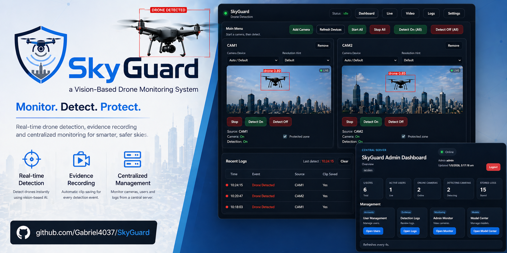

# SkyGuard

SkyGuard is a final year project developed for the Hong Kong Metropolitan University, School of Science and Technology, Bachelor of Science with Honours in Computer Science programme.

The project presents a LAN-based drone detection and monitoring system designed to support practical event logging, live monitoring, and centralised model management in a prototype deployment environment.

## Academic Context

- Institution: Hong Kong Metropolitan University
- School: School of Science and Technology
- Programme: Bachelor of Science with Honours in Computer Science
- Project Type: Final Year Project

## Project Overview

SkyGuard is organised as a two-part system:

- `client/`: detector node application responsible for camera input, YOLO-based drone detection, local event logging, clip generation, synchronisation, and optional live monitor streaming
- `server/`: central management application responsible for authentication, user administration, log management, uploaded clip review, camera monitoring, and model release management

The design separates detection execution from administrative control, allowing detector nodes and the central server to operate on different machines within the same local network.

## Current System Behavior

- Drone detection is performed on the client node using YOLO and OpenCV.
- Detection results are used live for overlays, alerts, event timing, and monitor updates.
- Event logs are intentionally minimal and store only core operational fields such as time, event, source, and clip reference.
- Event clips may be stored locally on the client node and synchronised to the central server.
- Detection crops are not saved.
- Bounding-box metadata is not persisted to local storage or central logs.

## Technical Stack

| Component | Technology |
| --- | --- |
| Backend services | Flask |
| Frontend interface | HTML, CSS, vanilla JavaScript |
| Database | SQLite |
| Detection runtime | YOLO, OpenCV |
| Client-server communication | HTTP over LAN |
| Model distribution | Central-server hosted `.pt` releases |

## Repository Structure

- `client/`: detector node application, local UI, runtime logic, sync logic, and local persistence
- `server/`: central server application, admin UI, central persistence, and model management
- `install_webview.py`: helper script for WebView-related setup on Windows
- `requirements.txt`: Python dependency list

## Functional Summary

### Client Node

- User login through central authentication
- Local camera registration and management
- Live camera and file-based detection workflows
- Overlay rendering with boxes, labels, trail, prediction curve, and timestamp
- Local clip recording for detection events
- Local log storage and background synchronisation to the central server
- Periodic model update checking and controlled model application when idle

### Central Server

- User authentication and administration
- Central log management
- Uploaded clip viewing and download
- Active camera monitoring
- Central model release management
- Dashboard summaries for users, logs, and active cameras

## Deployment Notes

- Required Python version: `3.11.9`
- The current implementation is intended for prototype and academic demonstration use.
- The system currently uses Flask's built-in server and SQLite for persistence.
- The active application flow is contained in `client/` and `server/`.
- The default client model file is `client/models/best_v11.pt`.
- The YOLO `.pt` model file is not included in this repository. Download the YOLOv11x drone detection weights from the model download page listed in the model attribution section and place the `.pt` file at `client/models/best_v11.pt`.

## Model Attribution

SkyGuard uses a YOLOv11x drone detection model based on the following open-source project:

Doguilmak, `Drone-Detection-YOLOv11x`  
https://github.com/doguilmak/Drone-Detection-YOLOv11x

Model weights download page: https://huggingface.co/doguilmak/Drone-Detection-YOLOv11x/tree/main/weight

The original project is released under the MIT License. The model is used in SkyGuard for academic demonstration and prototype drone-detection purposes. SkyGuard integrates the model into a separate client-server monitoring system; the original model training work belongs to the original author.

## License

This project is an academic Final Year Project developed for Hong Kong Metropolitan University (HKMU).

Copyright (c) 2026 Hong Kong Metropolitan University. All rights reserved.

No part of this project may be copied, redistributed, modified, or used for commercial purposes without prior written permission from Hong Kong Metropolitan University and the project author(s), except where permitted by applicable law or academic assessment requirements.

Please refer to the [`LICENSE`](LICENSE) file for the full notice.
